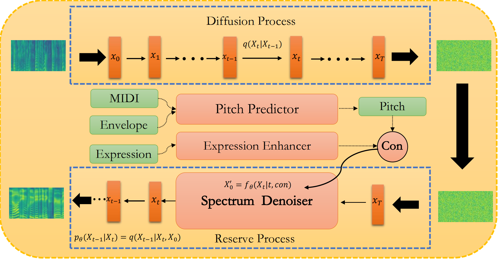

# DiffBeautifier:Fast Diffusion Model for High-Fidelity Singing Voice Beautifying
Author: anoymous

institution: anoymous

IJCAI 2023 Main conference


<div align="center">
    <a href="https://diffbeautifier.github.io" target="_blank">Project&nbsp;Page</a>
</div>

<p align="center">:construction: :pick: :hammer_and_wrench: :construction_worker:</p>

This repository is the official PyTorch implementation of our IJCAI-2023 paper. Now, we release the codes for Generator and condition based Diffusion, Pitch Predictor, Mel-Spectrogram Denosier in our paper. Please wait for dataset(DATASVB) and Expression Enhancer. 
  
```
condition.py involves the process of training and inference.
diffusion.py involves the baseline of Generator and condition Diffusion.
net.py involves Pitch Predictor, Mel-Spectrogram Denosier.
```


:rocket: **News**: 
 - January.18, 2023: We submitted DiffBeautifier to IJCAI2023.

## Dataset (DiffBeautifier-DATASVB) Acquirement
### Audio samples
- See in [apply_form](data/apply_form.md).
- Dataset will come soon.

### introduction of DATASVB
The sampling rate of each song can reach 44010Hz. In all, DATASVB consists of 100 Chinese pop songs (∼ 12 hours in total) and 300 English pop songs (∼30
hours in total), both male singers and female singers are included. In order to get closer to real life and the scene of SVB, DATASVB also contains out-of-tune samples and extremely amateurish samples. For each amateur sample, there is a one-to-one correspondence with the original song. For the original song, we will use Spleeter to separate the singing voice from the accompaniment and extract the pure human voice.

## Citation
If this repository helps your research, please cite:(come soon)

## Abstract

Singing voice beautifying (SVB) is a novel task that is widely used in practical scenarios. SVB task aims to correct the pitch of the singing voice and improve the expressiveness without changing the timbre and content. The major challenge of SVB is that paired data of professional songs and amateur songs is hard to obtain and we solved it for the first time. In this paper, we propose DiffBeautifier, an efficient diffusion model for highfidelity Singing Voice Beautifying. Since there are no paired data, diffusion model is adapted as our backbone, which is combined with modified conditions to generate our mel-spectrograms. We also reduce the number of steps of sampling t by using generator-based methods. For automatic pitch correction, we establish a mapping relationship from MIDI, spectrum envelope to pitch. To make amateur singing more expressive, we propose an expression enhancer in the latent space to convert the amateur vocal tone to the professional one. Furthermore, we produced a 40-hour singing dataset that contains original song vocals and extremely amateurish samples to promote the development of SVB. DiffBeautifier achieves a state-of-the-art beautification effect on both English and Chinese songs. Our extensive ablation studies demonstrate that expression part and generator-based methods in DiffBeautifier are effective. 

 


## Issues
 - Before raising a issue, please check our Readme and other issues for possible solutions.
 - We will try to handle your problem in time but we could not guarantee a satisfying solution.
 - Please be friendly.

